# Telegram Market Bot - Multi-Page Website Design

## Overview

The Telegram Market Bot is a multi-page e-commerce platform designed to sell ready-made Telegram bot templates. The platform enables users to browse, purchase, and download bot templates while providing administrative capabilities for template management.

### Core Value Proposition
- Marketplace for pre-built Telegram bot templates
- Instant demo bot generation via Telegram API
- Secure payment processing with cryptocurrency support
- User dashboard for purchase history and downloads
- Admin panel for template management

### Target Users
- **Developers**: Seeking ready-made bot solutions to accelerate development
- **Entrepreneurs**: Looking to deploy business bots without coding
- **Telegram Bot Creators**: Selling their bot templates

## Technology Stack & Dependencies

### Backend Framework Options
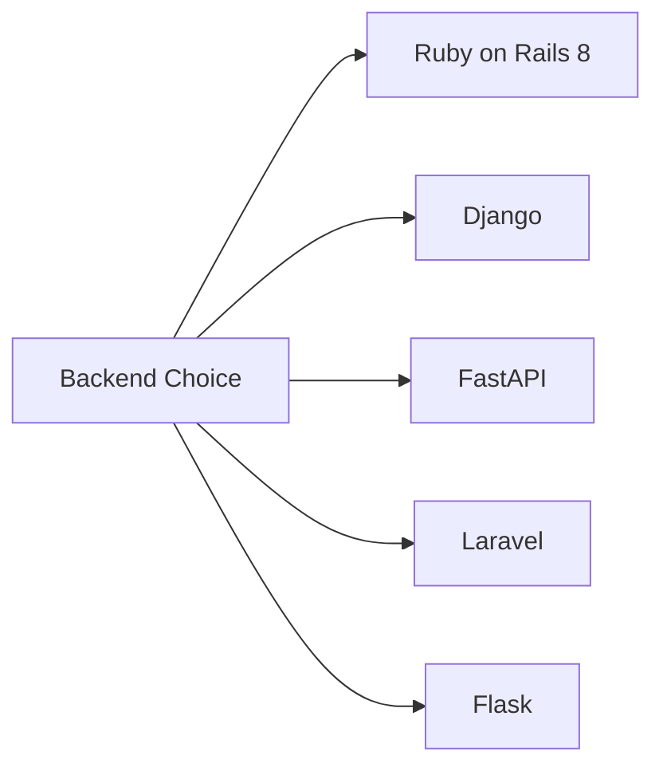

### Core Dependencies
- **Database**: PostgreSQL/MySQL (via framework ORM)
- **Payment Integration**: Telegram Payments API + Crypto payment plugins
- **File Storage**: Local filesystem or cloud storage for template files
- **API Integration**: Telegram Bot API for demo generation
- **Authentication**: Framework-native session management

### Frontend Technology
- **Styling**: Bootstrap or Tailwind CSS
- **JavaScript**: Vanilla JS for interactive elements
- **Template Engine**: Framework-native templating (Jinja2/ERB/Blade)

## Architecture

### System Architecture Overview
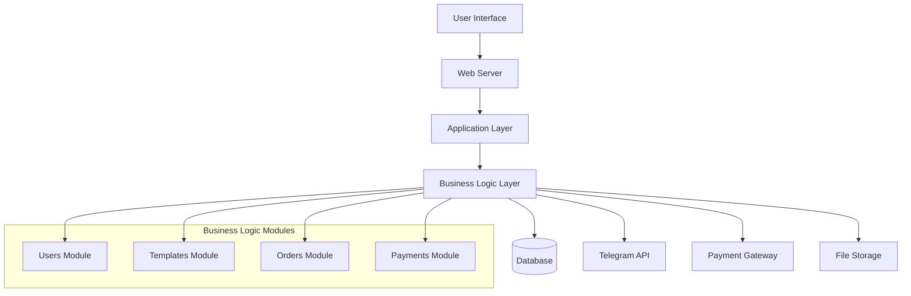

### Module Architecture
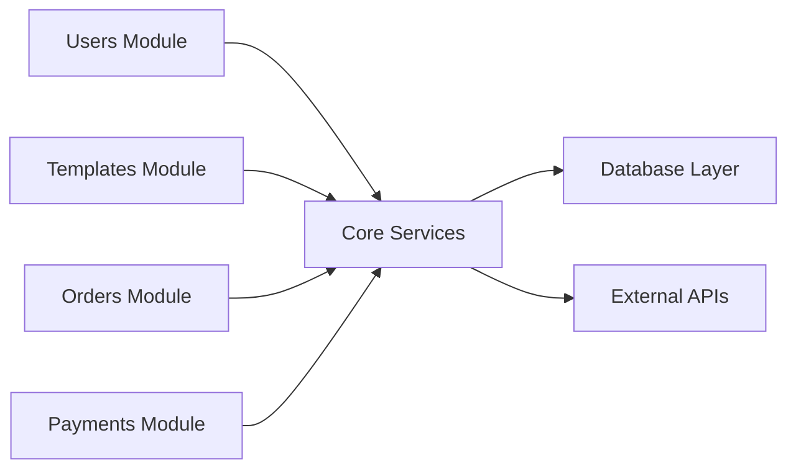

## Component Architecture

### Page Components Structure
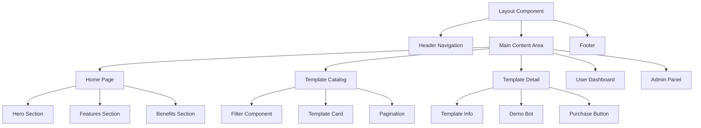

### Component Definitions

#### Template Card Component
- **Props**: template_id, title, description, price, thumbnail
- **State**: loading, demo_active
- **Methods**: showDetails(), generateDemo(), addToCart()

#### Filter Component  
- **Props**: categories, price_range, sort_options
- **State**: active_filters
- **Methods**: applyFilters(), resetFilters(), updateResults()

#### Purchase Component
- **Props**: template_data, user_session
- **State**: payment_method, processing
- **Methods**: initPayment(), processOrder(), downloadTemplate()

## Routing & Navigation

### URL Structure
```
/                           # Home page
/templates                  # Template catalog
/templates/category/:slug   # Category-filtered templates
/template/:id              # Individual template detail
/user/dashboard            # User profile and purchases
/user/downloads            # Downloaded templates
/user/orders               # Order history
/admin                     # Admin panel
/admin/templates           # Template management
/admin/orders              # Order management
/admin/users               # User management
/api/v1/*                  # REST API endpoints
```

### Navigation Flow
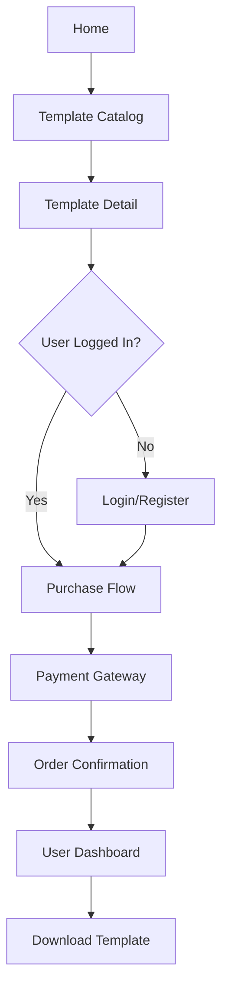

## Data Models & ORM Mapping

### Database Schema
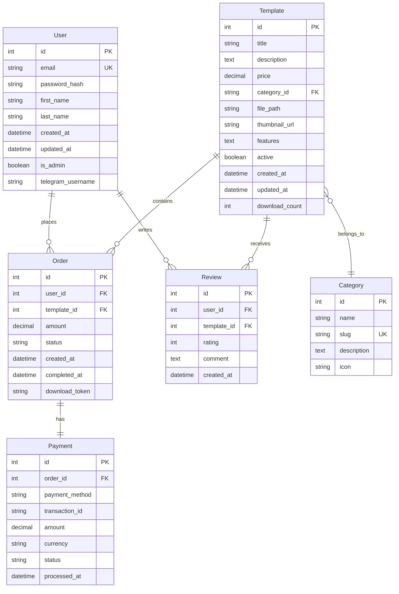

## API Endpoints Reference

### Authentication Endpoints
```
POST /api/v1/auth/register
POST /api/v1/auth/login
POST /api/v1/auth/logout
GET  /api/v1/auth/profile
PUT  /api/v1/auth/profile
```

### Template Endpoints
```
GET    /api/v1/templates              # List templates with filters
GET    /api/v1/templates/:id          # Get template details
POST   /api/v1/templates/:id/demo     # Generate demo bot
GET    /api/v1/categories             # List categories
```

### Order & Payment Endpoints
```
POST /api/v1/orders                   # Create new order
GET  /api/v1/orders                   # User's order history
GET  /api/v1/orders/:id               # Order details
POST /api/v1/payments/telegram        # Process Telegram payment
POST /api/v1/payments/crypto          # Process crypto payment
GET  /api/v1/downloads/:token         # Download purchased template
```

### Admin Endpoints
```
GET    /api/v1/admin/templates        # Admin template list
POST   /api/v1/admin/templates        # Create new template
PUT    /api/v1/admin/templates/:id    # Update template
DELETE /api/v1/admin/templates/:id    # Delete template
GET    /api/v1/admin/orders           # All orders
GET    /api/v1/admin/users            # User management
```

### Request/Response Schema

#### Template List Response
```json
{
  "templates": [
    {
      "id": 1,
      "title": "E-commerce Bot Template",
      "description": "Complete shopping bot with cart functionality",
      "price": 29.99,
      "category": "E-commerce",
      "thumbnail_url": "/images/templates/ecommerce-thumb.jpg",
      "features": ["Payment integration", "Product catalog", "Order tracking"],
      "demo_available": true
    }
  ],
  "pagination": {
    "current_page": 1,
    "total_pages": 5,
    "total_count": 48
  }
}
```

#### Order Creation Request
```json
{
  "template_id": 1,
  "payment_method": "telegram",
  "user_telegram": "@username"
}
```

## Business Logic Layer

### Template Management Feature
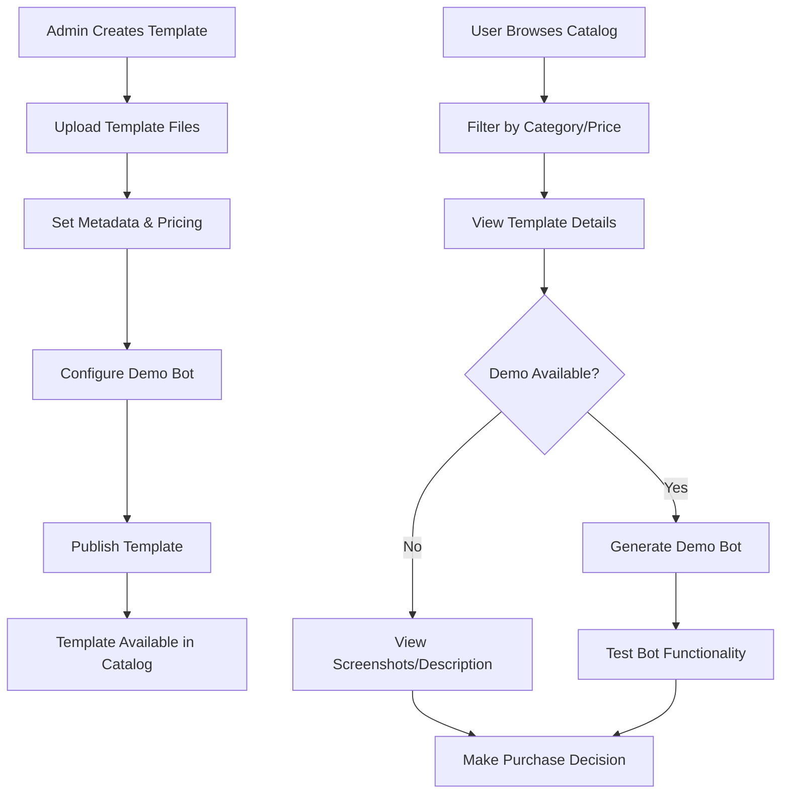

### Purchase Flow Feature
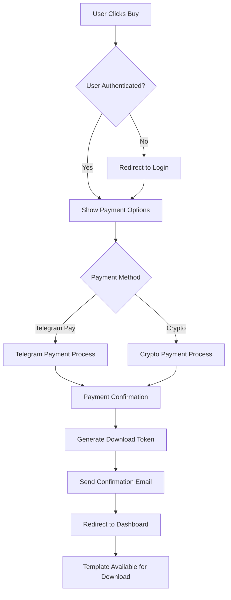

### Demo Bot Generation Feature
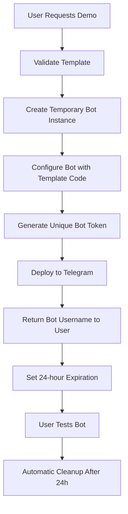

## Styling Strategy

### CSS Architecture
- **Framework**: Tailwind CSS for utility-first approach
- **Custom Variables**: CSS custom properties for theming
- **Component Styles**: Component-scoped styles for reusable elements
- **Responsive Design**: Mobile-first approach with breakpoints

### Design System
```css
:root {
  /* Color Palette */
  --primary-500: #3B82F6;
  --primary-600: #2563EB;
  --secondary-500: #6366F1;
  --success-500: #10B981;
  --warning-500: #F59E0B;
  --error-500: #EF4444;
  
  /* Typography Scale */
  --text-xs: 0.75rem;
  --text-sm: 0.875rem;
  --text-base: 1rem;
  --text-lg: 1.125rem;
  --text-xl: 1.25rem;
  --text-2xl: 1.5rem;
  
  /* Spacing System */
  --space-1: 0.25rem;
  --space-2: 0.5rem;
  --space-4: 1rem;
  --space-8: 2rem;
  --space-16: 4rem;
}
```

### Responsive Breakpoints
- **Mobile**: 320px - 767px
- **Tablet**: 768px - 1023px  
- **Desktop**: 1024px+

## State Management

### User Session Management
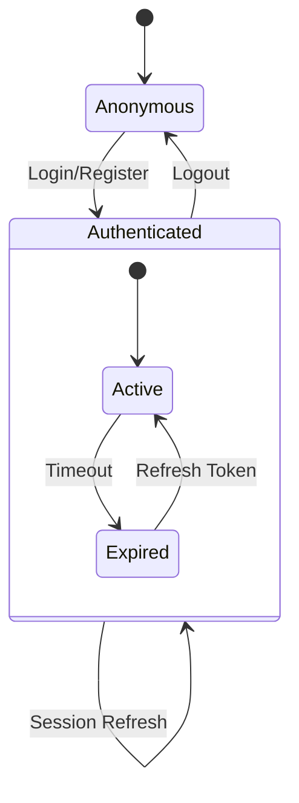

### Shopping Cart State (Client-side)
```javascript
// Cart state structure
const cartState = {
  items: [
    {
      templateId: 1,
      title: "E-commerce Bot",
      price: 29.99,
      addedAt: timestamp
    }
  ],
  total: 29.99,
  currency: "USD"
};
```

### Order Processing State
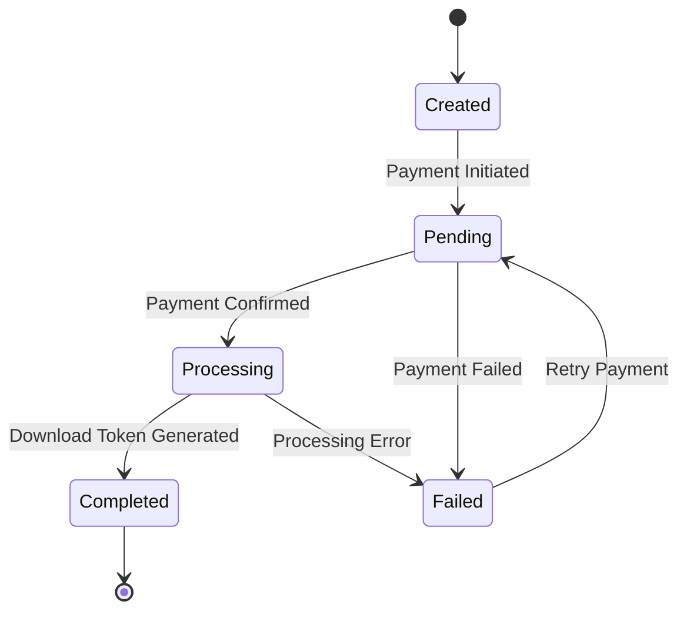

## Middleware & Interceptors

### Authentication Middleware
- **Purpose**: Verify user sessions and JWT tokens
- **Implementation**: Check authentication on protected routes
- **Redirect**: Unauthenticated users to login page

### Rate Limiting Middleware  
- **Purpose**: Prevent API abuse and demo bot spam
- **Limits**: 
  - API calls: 100 requests/minute per IP
  - Demo generation: 5 demos/hour per user
  - Download attempts: 10/hour per user

### Request Logging Middleware
- **Purpose**: Track API usage and errors
- **Data**: Request method, URL, user ID, response time, status code

### CORS Middleware
- **Purpose**: Enable cross-origin requests for API
- **Configuration**: Allow requests from web domain only

## Testing Strategy

### Unit Testing
- **Framework**: Framework-native testing tools (pytest, RSpec, PHPUnit)
- **Coverage**: Business logic methods, API endpoints, data models
- **Mock Objects**: External API calls (Telegram, payment gateways)

### Integration Testing  
- **Database**: Test ORM queries and relationships
- **API**: Test complete request/response cycles
- **Payments**: Test payment flow with sandbox environments

### End-to-End Testing
- **User Flows**: Registration, template purchase, download process
- **Admin Flows**: Template creation, order management
- **Cross-browser**: Chrome, Firefox, Safari compatibility

### Testing Data
```python
# Sample test fixtures
test_user = {
    "email": "test@example.com",
    "password": "secure_password",
    "telegram_username": "@testuser"
}

test_template = {
    "title": "Test Bot Template",
    "description": "A simple test bot",
    "price": 9.99,
    "category": "utilities",
    "file_path": "/test/bot_template.zip"
}
```